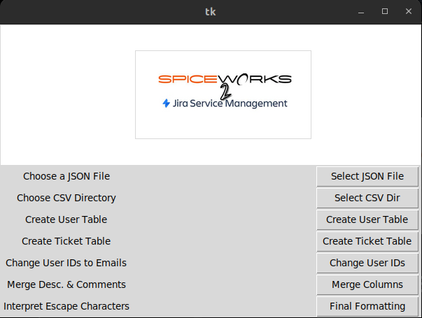
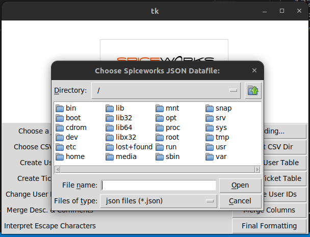
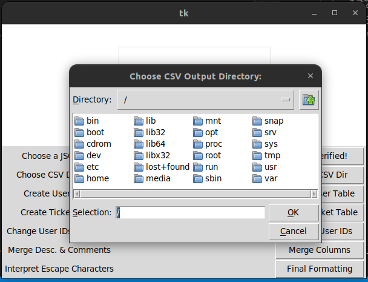
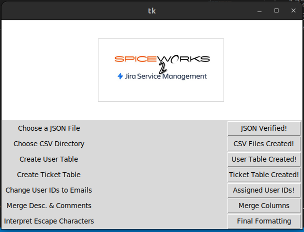

# Spice2JIRA
A small python tool for preparing a migration from Spiceworks to Jira Service Management.

## Summary
Spiceworks used to a free, self-hosted ticketing system.  Their current system has left their core customer base with the choice of leaving their self-hosted solution with the option of using an unsupported solution or be migrated on to their paid, cloud-hosted solution.

Spiceworks has been harvesting user submitted data for a very long time.  They have also been using self-hosted resources to present advertisements with the processsing power of their customers, to serve advertisements on internal tickets as a revenue model.  Since their change to the cloud-based SaaS model, many users have decided their product offering isn't what it's cracked up to be. Those end-users have decided (to their own detriment) that JIRA Service Management is a much better solution for the price and feature set.  If your internal IT Services team is less than 5 users, this might be a tool for you for free.  If your IT Services team is larger than that, this is still a tool for you.

## Step 1 - Select Your JSON File

## Step 2 - Select the Output Directory for CSV Files

## Step 3 - Create the Spiceworks User Table

## Step 4 - Create the Spiceworks Ticket Table

## Step 5 - Assign User ID Numbers to E-Mail Addresses

## Step 6 - Merge Description & Comment Columns

## Step 7 - Interpret Unicode Escape Characters

