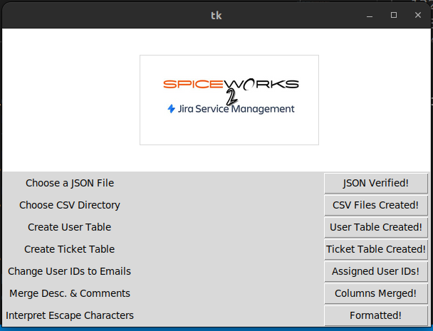

# Spice2JIRA
A small python tool for preparing a migration from Spiceworks to Jira Service Management.

## Summary
Spiceworks used to be a free, self-hosted ticketing system.  Their current system has left their core customer base with the choice of leaving their self-hosted solution with the option of using an unsupported solution or be migrated on to their paid, cloud-hosted solution.

Spiceworks has been harvesting user submitted data for a very long time.  They have also been using self-hosted resources to present advertisements with the processsing power of their customers, to serve advertisements on internal tickets as a revenue model.  Since their change to the cloud-based SaaS model, many users have decided their product offering isn't what it's cracked up to be. Those end-users have decided (to their own detriment) that JIRA Service Management is a much better solution for the price and feature set.  If your internal IT Services team is less than 5 users, this might be a tool for you for free.  If your IT Services team is larger than that, this is still a tool for you. You just might need to put more work into scrubbing the data (depending how long you've been using spiceworks).

Each button to press in the application is a step for an administrator to check and scrub their data to make sure it's ready for an import to JIRA Serivce Management... which also used to be called JIRA Service Desk. For how much Atlassian has issues, it's probably not as bad as Spiceworks is.

This methodology will help IT Admins prepare for their eventual move to a tool that is used by the wider technology industry. For better or for worse.

## Step 1 - Select Your JSON File

This is place where you're going to be able to select the JSON file where all of your ticket and user data has been exported to.  Please keep in mind at this point, this application is only validating this is correct JSON, and not the format that is needed for the rest of the steps in this process.

## Step 2 - Select the Output Directory for CSV Files

The directory chosen here is where `users.csv` and `tickets.csv` going to be created. Once the csv files are created, headers are added to the csv file. This will be the working directory for the rest of the prepared import file to JIRA Service Management.

## Step 3 - Create the Spiceworks User Table

## Step 4 - Create the Spiceworks Ticket Table

## Step 5 - Assign User ID Numbers to E-Mail Addresses

## Step 6 - Merge Description & Comment Columns

## Step 7 - Interpret Unicode Escape Characters

